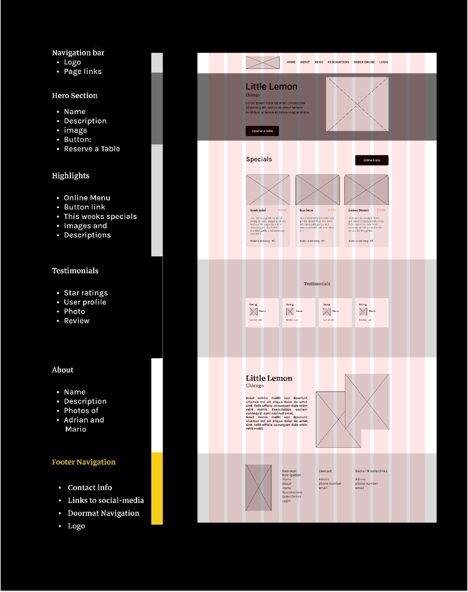

# 🚀 Meta Front-End Developer Capstone Project

This project is the final capstone for the [Meta Front-End Developer Professional Certificate](https://www.coursera.org/professional-certificates/meta-front-end-developer).

👤 **Created by Cedrus Dang**

---

## 📝 Project Overview

This application demonstrates advanced React development skills, including:

* 🧩 Component-based architecture
* ⚡ State management
* 📱 Responsive design
* ♿ Accessibility
* 💡 Modern front-end best practices

The codebase is structured for scalability and maintainability, meeting professional standards for real-world front-end applications.

---

## ✨ Features

* **Online Table Booking**: Users can reserve tables by filling out a form with real-time validation for required fields, date, time, and party size. Confirmation and error messages provide clear feedback.
* **Admin Page for Reservations**: Admins can view, manage, and update all reservations. Includes search/filter functionality and simulated data updates for demo/testing.
* **Responsive Design**: The UI adapts seamlessly to mobile, tablet, and desktop screens, ensuring a consistent experience across devices.
* **Accessibility**: Implements ARIA roles, keyboard navigation, and color contrast standards for an inclusive user experience.
* **Modular, Reusable Components**: All UI elements (forms, banners, cards, etc.) are built as independent, reusable React components for easy maintenance and scalability.
* **Modern Theming & UI**: Uses a modern design system based on Figma specs, with support for theming and visually appealing layouts.
* **Customer Testimonials & Dish Showcase**: Displays rotating customer reviews and a gallery of featured dishes, enhancing credibility and engagement.
* **Testing**: Includes unit and integration tests for core components and booking logic, using Jest and React Testing Library.
* **Local Client Server for Simulated Testing**: The app runs on a local development server (`npm start`) with mock data and simulated API calls, allowing you to test all features without a real backend. Booking and admin actions are reflected in the UI and local state for demonstration purposes.

---

## 🎨 UX/UI Design Compliance

This project strictly follows **Meta Front-End Developer Professional Certificate UX/UI Design 1 & 2** principles.
All components, grid, layout, and visual details are implemented according to the official Meta Figma design for the capstone.

* 📐 **Figma design reference:**
  Both the initial wireframe and the final high-fidelity UI (see below) were used as design sources.

* 🗂️ **Design files included:**
  `Design.png` and `Design2.png` are provided in the root project directory, alongside this README.

**Wireframe and Final Design Reference:**

 

All code and layout are built according to these Figma designs to ensure professional UI/UX as per Meta guidelines.

---

## 🛠️ Available Scripts

In the project directory:

* `npm start`
  ▶️ Start the app in development mode. Open [http://localhost:3000](http://localhost:3000) in your browser.
  The page automatically reloads on code changes.

* `npm test`
  🧪 Launch the test runner in interactive watch mode.

* `npm run build`
  🏗️ Build the app for production to the `build` folder, with optimized assets and hashed filenames.

* `npm run eject`
  ⚠️ **Irreversible.** Copies all build configuration files and dependencies into your project, giving full control over setup. Not recommended unless required.

---

## 🚀 Deployment

For deployment guidelines, refer to [Create React App deployment documentation](https://facebook.github.io/create-react-app/docs/deployment).

---

## 📚 Additional Resources

* [React Documentation](https://reactjs.org/)
* [Meta Front-End Professional Certificate Program](https://www.coursera.org/professional-certificates/meta-front-end-developer)
* [Create React App Docs](https://facebook.github.io/create-react-app/docs/getting-started)

---

✨ **This project follows Meta Front-End Developer Capstone best practices for UI/UX, code quality, and deployment readiness.**

**Author:** Cedrus Dang